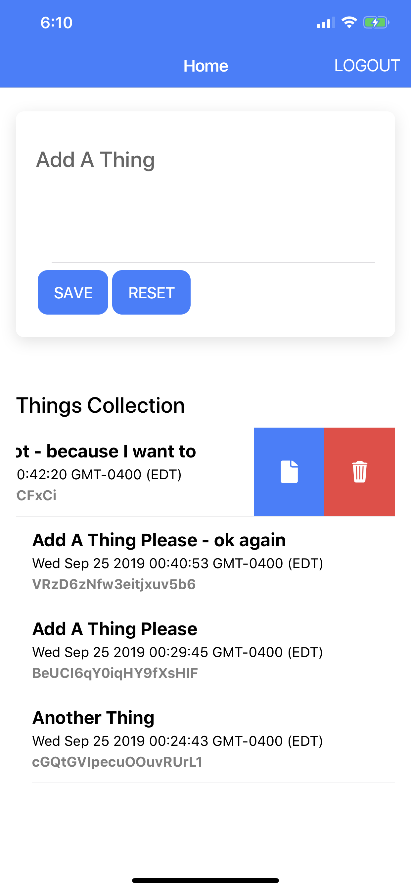

## react-course-firebase-hooks-app

This project was bootstrapped with [Create React App](https://github.com/facebook/create-react-app).

Sample app integrating firebase with a react application using react hooks api and [React Firebase Hooks](https://github.com/CSFrequency/react-firebase-hooks) - A set of reusable [react hooks](https://reactjs.org/docs/hooks-intro.html) for [Firebase](https://firebase.google.com/docs/web/setup?authuser=0).

<div  style="padding-right: 10px">

  </div>

</div>

## Getting A Collecting of Things

This is from firebase-hooks, it allows us to query all of the item from the `things` collection in the database in descending order based on the creation data. the `value` will containg the results of the query that we will loop through to render the list items

```javascript
const [value, loading, error] = useCollection(
  firebase
    .firestore()
    .collection("things")
    .orderBy("createdOn", "desc"),
  {
    snapshotListenOptions: { includeMetadataChanges: true }
  }
);
```

## Getting a Specific Thing

We use the firebase-hooks to get a specific object using the id of the object we want to retrieve

```javascript
// get a document if there is an initial value
const [value, loading, error] = useDocument(
  firebase.firestore().doc("things/" + objectId),
  {
    snapshotListenOptions: { includeMetadataChanges: true }
  }
);
```

## Adding Or Updating a Specific Thing

if editing then we use the firebase-hooks to get the specific object using the
`initialValue` property that is passed to the component

```javascript
// get a document if there is an initial value
const [value, loading, error] = useDocument(
  firebase.firestore().doc("things/" + initialValue),
  {
    snapshotListenOptions: { includeMetadataChanges: true }
  }
);
```

When saving the thing, determine if it is a new object or an existing object by checking to see if there was an `initialValue` provided as a property. If there was, then we have an object id so we need to update the object and not create a new object

```javascript
/**
 * on save determine if it is a new object or an existing object
 * by check to see if there was an initial value provided
 */
const onSave = async () => {
  let collectionRef = firebase.firestore().collection("things");

  if (initialValue) {
    await collectionRef
      .doc(initialValue)
      .set({ name: thing, updatedOn: new Date().getTime() }, { merge: true });
    setThing("");
    clear();
  } else {
    await collectionRef.add({ name: thing, createdOn: new Date().getTime() });
    setThing("");
    clear();
  }
};
```

## Deleting A Specific Thing

There is no firebase-hook to delete an object, we just used the firebase javascript api to remove the object

```javascript
/**
 * deletes item from firebase database using the id
 * of teh object
 *
 * @param {*} id
 */
const doDelete = id => {
  firebase
    .firestore()
    .collection("things")
    .doc(id)
    .delete();
};
```

## Setting Up For Capacitor

### Add Capacitor (https://capacitor.ionicframework.com) to Project:

```
npm install --save @capacitor/core @capacitor/cli
```
OR
```
yarn add  @capacitor/core @capacitor/cli
```

### Package up app for build:

```
npm run build
```
OR
```
yarn run build
```

### Initialize Capacitor with your app information.

```
npx cap init --web-dir=build
```

> you will be asked the following questions:

```
Create app name
Create app Package ID (com.example.app)
```

> In some instances of iOS you will be required to do an additional install

OPTIONAL: install CocoaPods if not already installed (CocoaPods manages library dependencies for your Xcode projects):

```
sudo gem install cocoapods
```

### Install the desired native platform:

```console
npx cap add android
npx cap add ios
npx cap add electron
```

### Sync the platform specific code

```
npx cap sync iOS
npx cap open iOS (or Android) -> this should open up Xcode or Android Studio
```

## Deal with safe area, ie the notch on some of the newer devices

```html
<meta
  name="viewport"
  content="width=device-width, initial-scale=1, viewport-fit=cover"
/>
```

And set the css for the body

```css
body  {
    padding: env(safe-area-inset-top,  20px)  env(safe-area-inset-right,  20px)
        env(safe-area-inset-bottom,  20px)  env(safe-area-inset-left,  20px);
}
```
